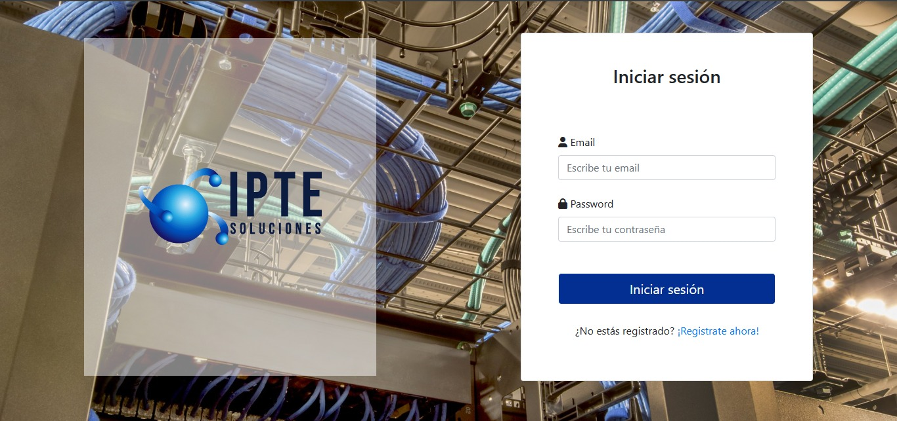
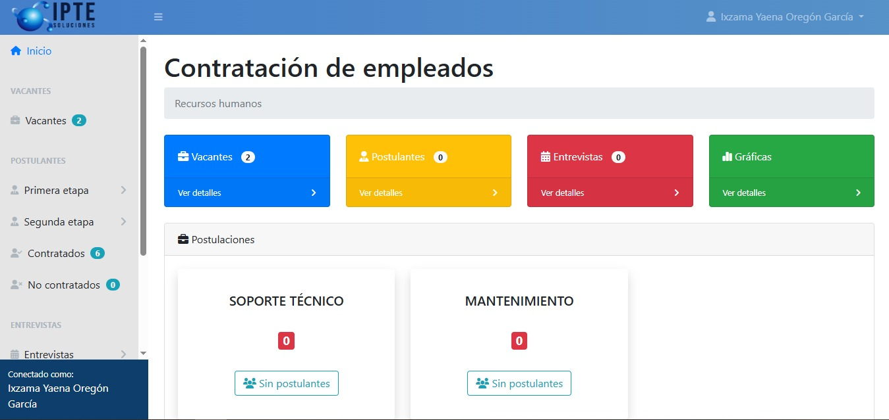
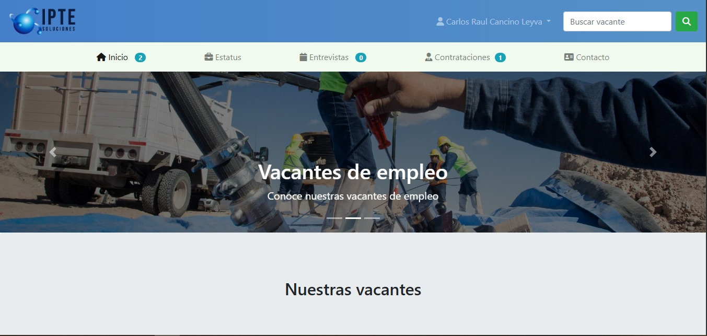
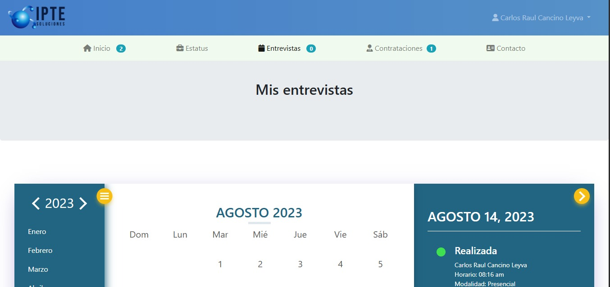

# IPTE Postulaciones

Proyecto escolar realizado la gestión del proceso de contratación de empleados dentro de la empresa IPTE Soluciones.
Cuenta con dos tipos de usuarios: RH y postulante.

Fue desarrollado con HTML, CSS, JS, dataTables además del uso del framework Bootstrap.

- Capturas de pantalla

## Usuario Recursos Humanos

## Usuario Postulante

- Tecnologías

* HTML
* CSS
* JavaScript
* Bootstrap 

- Realizaco por: Maria Xitlali Valenzo Serna
- Fecha de realización: 2023
